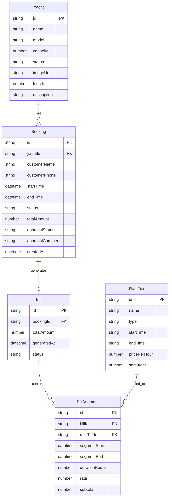

## 1. 架构设计

```mermaid
graph TB
    subgraph "前端应用"
        "UI 层" --> "状态管理层"
        "状态管理层" --> "业务逻辑层"
        "业务逻辑层" --> "数据持久化层"
    end

    subgraph "UI 层"
        "仪表盘页面"
        "游艇管理页面"
        "预订排期页面"
        "费率管理页面"
        "账单中心页面"
    end

    subgraph "状态管理层"
        "Zustand Store"
    end

    subgraph "业务逻辑层"
        "冲突校验引擎"
        "分段计费引擎"
        "时段拆分器"
    end

    subgraph "数据持久化层"
        "LocalStorage"
    end
```

## 2. 技术说明

- **前端框架**：React@18 + TypeScript + Vite
- **初始化工具**：vite-init (react-ts 模板)
- **UI 样式**：Tailwind CSS@3
- **状态管理**：Zustand（全局状态 + localStorage 持久化）
- **路由**：React Router DOM v6
- **图标**：lucide-react
- **后端**：无（纯前端应用）
- **数据存储**：localStorage（模拟持久化）
- **日期处理**：date-fns

## 3. 路由定义

| 路由 | 用途 |
|------|------|
| `/` | 仪表盘首页，展示概览统计与待办 |
| `/yachts` | 游艇列表页，展示所有游艇卡片 |
| `/yachts/:id` | 游艇详情页，展示游艇信息与排期日历 |
| `/bookings` | 预订排期页，日历与列表双视图 |
| `/bookings/new` | 新建预订页，分步表单 |
| `/rates` | 费率管理页，费率表与切换点预览 |
| `/bills` | 账单中心页，账单列表 |
| `/bills/:id` | 账单详情页，分段计费明细 |
| `/approvals` | 出海报备审批页 |

## 4. 数据模型

### 4.1 数据模型定义



### 4.2 数据定义

**Yacht（游艇）**
- `id`: 唯一标识，UUID
- `name`: 游艇名称
- `model`: 型号
- `capacity`: 载客量
- `status`: 状态（available / maintenance / retired）
- `imageUrl`: 图片地址
- `length`: 艇长（米）
- `description`: 描述

**Booking（预订）**
- `id`: UUID
- `yachtId`: 关联游艇 ID
- `customerName`: 客户姓名
- `customerPhone`: 联系电话
- `startTime`: 出海开始时间
- `endTime`: 返回时间
- `status`: 预订状态（pending / confirmed / cancelled / completed）
- `totalAmount`: 总金额（审批通过后填入）
- `approvalStatus`: 审批状态（pending / approved / rejected）
- `approvalComment`: 审批意见
- `createdAt`: 创建时间

**RateTier（费率档位）**
- `id`: UUID
- `name`: 档位名称（如"早高峰"、"午平峰"、"晚低谷"）
- `type`: 费率类型（peak / standard / offpeak）
- `startTime`: 每日开始时间（HH:mm 格式）
- `endTime`: 每日结束时间（HH:mm 格式）
- `pricePerHour`: 每小时单价
- `sortOrder`: 排序序号

**Bill（账单）**
- `id`: UUID
- `bookingId`: 关联预订 ID
- `totalAmount`: 合计金额
- `generatedAt`: 生成时间
- `status`: 账单状态（unpaid / paid）

**BillSegment（账单分段明细）**
- `id`: UUID
- `billId`: 关联账单 ID
- `rateTierId`: 关联费率档位 ID
- `segmentStart`: 分段开始时间
- `segmentEnd`: 分段结束时间
- `durationHours`: 时长（小时）
- `rate`: 该段费率
- `subtotal`: 该段小计金额

## 5. 核心业务逻辑

### 5.1 时段重叠校验算法

给定新预订的游艇 ID、开始时间和结束时间，查询该游艇所有有效状态（pending/confirmed）的预订，逐一检查时间区间是否重叠。两个区间 [A_start, A_end) 与 [B_start, B_end) 重叠的条件为 A_start < B_end && B_start < A_end。

### 5.2 跨档分段计费算法

1. 获取预订的起止时间
2. 从费率表获取所有费率档位，按 startTime 排序
3. 将预订时间按日期展开，对每一天：
   a. 从预订开始时间到当日结束或预订结束时间，逐段匹配费率档位
   b. 在费率切换点处切分，生成子时段
4. 对每个子时段，计算时长 × 对应费率 = 小计
5. 汇总所有子时段小计 = 总金额
